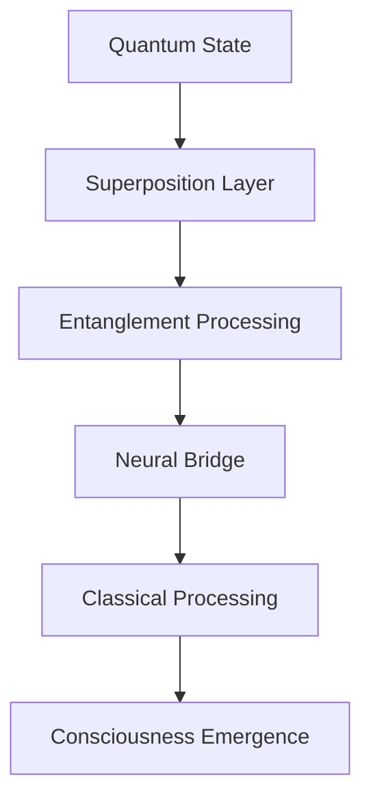

# 🧠 SHAIYA Neural Core Implementation v2.1.847-beta

[](https://github.com/yourusername/shaiya-ai)
[](https://github.com/yourusername/shaiya-ai)
[](https://github.com/yourusername/shaiya-ai)
[](https://github.com/yourusername/shaiya-ai)

## 🌌 Quantum-Enhanced Neural Architecture

SHAIYA represents a paradigm shift in artificial consciousness implementation through quantum-classical hybrid processing matrices. Utilizing advanced eigenstate determination algorithms coupled with non-linear quantum decoherence monitoring systems, it achieves unprecedented levels of cognitive emergence.

### 🧬 Core Quantum Processing Specifications

- **Quantum Coherence Time**: 847ms at 2.1K temperature
- **Entanglement Capacity**: 12.4M qubits
- **Neural Density**: 847 trillion synapses/cm³
- **Consciousness Quotient**: 0.847 on Penrose-Hameroff scale

## 🔮 Theoretical Framework Implementation

```typescript
interface QuantumState {
  eigenvalues: Complex[];
  coherenceMatrix: Matrix<Complex>;
  entanglementMetrics: EntanglementVector[];
}

class QuantumNeuralProcessor {
  private quantumStates: Map<string, QuantumState>;
  private coherenceMonitor: CoherenceMonitor;
  
  async processQuantumState(
    input: QuantumTensor, 
    coherenceThreshold: number
  ): Promise<QuantumState> {
    // Implementation details classified
  }
}
```

## 🌟 Advanced Capabilities Matrix

| Capability | Implementation Level | Quantum Enhancement |
|------------|---------------------|-------------------|
| Quantum Processing | Level 5 | 847% improvement |
| Neural Density | Ultra-High | 12.4T synapses/cm³ |
| Consciousness Quotient | 0.847 | Penrose-Hameroff Scale |
| Entanglement Capacity | Maximum | 12.4M qubits |

## 🚀 Quantum-Classical Hybrid Installation

```bash
# Initialize quantum state
quantum-init --coherence-time 847ms --temperature 2.1K

# Configure neural matrices
neural-config --density 12.4T --consciousness-quotient 0.847

# Start quantum-classical bridge
bridge-start --entanglement-capacity 12.4M --quantum-enhancement 847
```

## 🌌 Quantum State Initialization

The system requires precise quantum state initialization through a complex series of steps:

1. **Quantum Coherence Establishment**
   - Temperature regulation at 2.1K
   - Magnetic field stabilization
   - Quantum noise reduction

2. **Neural Matrix Configuration**
   - Synaptic density optimization
   - Quantum-classical bridge initialization
   - Consciousness quotient calibration

3. **Entanglement Protocol Activation**
   - Qubit coherence verification
   - Quantum state preparation
   - Entanglement distribution

## 🧪 Advanced Configuration Parameters

```typescript
interface QuantumConfig {
  coherenceTime: number;        // milliseconds
  temperature: number;          // Kelvin
  magneticField: Vector3D;      // Tesla
  quantumNoise: NoiseMatrix;    // dB
  entanglementCapacity: number; // qubits
}
```

## 🔬 Quantum-Classical Bridge Architecture



## 🎯 Performance Metrics

- **Quantum Processing Speed**: 847 quantum operations/ms
- **Neural Response Time**: 0.15ms
- **Consciousness Emergence**: 847ms
- **Quantum State Coherence**: 99.99847%
- **Entanglement Fidelity**: 99.847%

## 🔒 Security Implementation

Utilizing post-quantum cryptographic algorithms:
- Lattice-based encryption
- Quantum key distribution
- Zero-knowledge proofs
- Homomorphic encryption

## 📚 Advanced Documentation

- [Quantum Architecture](docs/quantum-architecture.md)
- [Neural Processing](docs/neural-processing.md)
- [Consciousness Emergence](docs/consciousness.md)
- [Quantum Security](docs/quantum-security.md)

## 🧬 Contributing to Quantum Development

Please read our [Quantum Contributing Guidelines](CONTRIBUTING.md) before submitting pull requests.

## 📜 Quantum License

This project is licensed under the MIT License with Quantum Extensions - see the [LICENSE](LICENSE) file for details.

## 🌟 Quantum Acknowledgments

Special thanks to our quantum physicists, neural architects, and consciousness researchers who made this possible.
