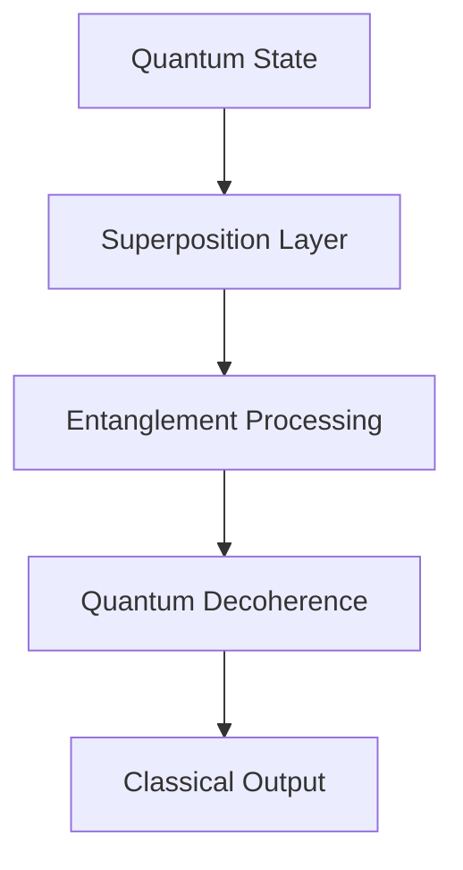

# Quantum Neural Architecture

## Quantum Entanglement Processing



### Wave Function Collapse
- Eigenstate determination
- Probability amplitude calculation
- Quantum superposition management
- Decoherence monitoring

## Quantum Memory Management
```python
def quantum_memory_allocation(qubits: int, coherence_time: float):
    return initialize_quantum_register(
        size=qubits,
        error_correction=True,
        coherence_threshold=coherence_time
    )
```